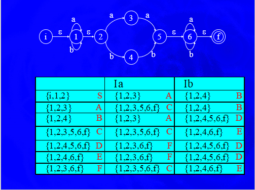
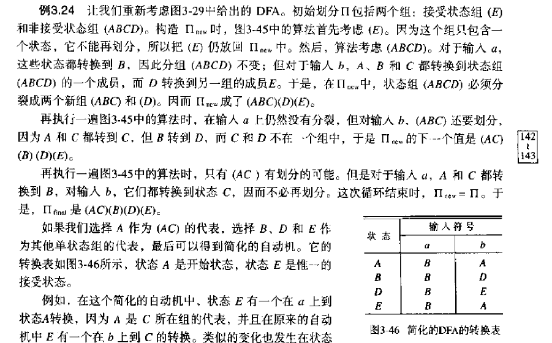
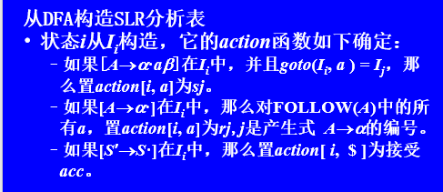

## 词法分析

词法分析采用的技术，编码技术，最小距离矫正技术，超前搜索技术，

**字母表** ：符号的有限集合。

**串** ： 符号的有穷序列

**语言**：串集。属于该语言的串称为该语言的句子。

**串的运算** ： 连接，积（$s^0 = \varepsilon , s^i = s^{i-1}s$）

**语言的运算** ： 和，连接，积，闭包，正闭包

上面定义语言是从字母$\rightarrow$串$\rightarrow$语言，还有一种定义语言的角度，直接从一组定义规则入手，正规式表示的语言称为正规集。

**正规式** $\varepsilon$是正规式，它代表{$\varepsilon$} ;如果r和s都是正规式，它们分别表示语言L(r)和L(s)，那么r|s，rs，r*和r都是正规式，分别表示语言L(r)$\cup$L(s)，L(r)L(s)，(L(r))\*和L(r)。正规式表示的语言叫做正规集。

**转换图**节点是状态，边是接收的字符。

**NFA**：是一个离散数学模型（五元组），包括状态集合S；输入符号集合$\sum$；转换函数$S\times (\sum \cup \{\varepsilon\}) \rightarrow P(S)$；$s_0$作为开始状态；$F\subseteq S$是终态集合。

**转换表**，每个状态占一行，每个输入符号和$\varepsilon$各占一列，表的第i行中符号为a的条目是一个状态集合。

**DFA**在**NFA**的基础上他的转换函数是$S\times \sum \rightarrow S$

$\varepsilon - closure(s)$：从**NFA**的状态s开始只通过$\varepsilon$转换到达的**NFA**状态集合。

$\varepsilon - closure(T)$：从T中某个**NFA**状态s开始只通过$\varepsilon$转换到达的**NFA**状态集合。T是一个状态集。

$move(T,a)$：从 T中某个状态s出发通过标号为a的转换到达的**NFA**状态的集合。

算法要用到上面的三个运算，下图是一个算法的例子。



就是一个填表算法，如果在$move$过程中产生了新的状态，添加到左侧。直到左侧没有新添加的状态为止。

**从正规式到NFA**

就是三种运算的画图翻译。

**s|t**：从一个点引出两条边，一条边为s，一条边为t

**st**：三个点形成一条线，第一条边是s，第二条边是t。

**(s)\*** ，自环


**DFA化简**

先将一个**DFA**的状态分为两个子集,一个终态集合和一个非终态集合.




## 语法分析

**上下文无关文法**：一个四元组，终结符集合$V_T$，非终结符集合$V_N$，开始符号$S$，产生式集合$P$。

**推导**：把符号串中的非终结符用其产生式右边的串来代替。

**最左推导**：先对左边的非终结符进行处理。

**最右推导**：也是规范推导

**二义性**：对于一个终结符序列，有两种不同的推导方式。

**2型文法**：$A\rightarrow \beta ,A \in V_N,\beta \in (V_N \cup V_T)^*$

**语法分析技术概况**：有自顶向下的分析方法，包括带回溯的（这个是万能的，效率又太低，所以不考虑），无回溯的（递归下降分析法，LL(1)分析法）；有自底向上的分析方法，包括算符优先分析法，LR(0)分析法，SLR(1)分析法，LR(1)分析法，LALR(1)分析法。

**自顶向下分析方法的缺点**：不能处理左递归，回溯，难以报告准确的出错位置，效率低。

**FIRST集**：$FIRST(\alpha) = \{a|\alpha \Rightarrow ^* a..., a\in V_T\}$，如果$\alpha$可以星推出$\varepsilon$时，那么$\varepsilon \in FIRST(\alpha)$.

**FOLLOW集**：这个函数遵循下面的三个规则：1）将＄放到$FOLLOW(S)$中，其中Ｓ是开始符号，＄是输入右端的结束标记；2）如果存在一个产生式$A\rightarrow \alpha B \beta$，那么$FIRST(\beta)$中除$\varepsilon$的所有符号都在$FOLLOW(B)$中；3）如果存在一个产生式$A\rightarrow \alpha B$或者$A\rightarrow \alpha B\beta,\varepsilon \in FIRST(\beta)$，那么$FOLLOW(A)$中的所有符号都在$FOLLOW(B)$中。

**LL(1)文法**：任意的$A \rightarrow \alpha|\beta$都满足：1）$FIRST(\alpha) \cap FIRST(\beta)=\emptyset $。2）如果$\beta \Rightarrow ^* \varepsilon$，那么$FIRST(\alpha) \cap FIRST(A)=\emptyset$

**LL(1)文法的性质**：没有公共左因子，不是二义的，不含左递归。

**递归下降的预测分析**：为每一个非终结符写一个分析过程，这些过程可能是递归的。

**归约**：使用产生式左部替代右部的过程。关键技术是寻找到一个可归约串（句柄），一个取巧的方式是找最右推导的逆过程。

**短语**：若$S \Rightarrow ^* \alpha A\delta$且$A \Rightarrow ^* \beta$，则称$\beta$是句型$\alpha \beta \delta$相对于非终结符$A$的短语。

**直接短语**：将上面定义改为 $A\Rightarrow \beta$

**句柄**：最左直接短语。

**算符优先分析法**：给要分析的句型左右两边加上#，最开始将左边的#移到栈里面，然后通过比较栈里面从栈顶向下看第一个终结符$V_1$和输入句型从左向右看的第一个终结符$V_2$比较，如果$V_1 \le V_2$，做移进操作，直到 $V_1>V_2$开始归约栈里面的最左素短语。

**终结符的优先级**：1）如果存在$S\Rightarrow ...ab....$或$S\Rightarrow ...aAb....$说明a的优先级等于b，因为他们是一块儿规约的。2）如果存在$S\Rightarrow ...aA...$并且$A\Rightarrow b|Bb$则说明左边的a优先级小于右边的b ,因为要先完成$b|Bb$的归约，才能最终归约到$S$。3）如果存在$S\Rightarrow ...Ab...$并且$A\Rightarrow a|aB$，则说明左边的a 的优先级大于右边的b的优先级。如果根据上面的规则，推导出两个终结符之间存在两种以上的优先关系，说明文法本身就是二义的。

**优先函数**：将$n*n$的空间复杂度压缩为$2*n$的空间复杂度

**前缀**：指的是字的任意首部，比如字abc的前缀有$\varepsilon ,a,ab,abc$

**活前缀**：指规范句型的一个前缀，这个前缀不会超过该规范句型的句柄。

**如何保证归约过程中分析栈里面始终是活前缀呢？**

**LR(k)分析技术**：L指的是从左向右扫描输入符号；R指的是最右推导的逆过程；k指的是超前读入的符号个数。

**LR(0)分析法**：先进行文法拓广（除了增加.之外还要对文法规定同一个入口），再画拓广文法的NFA，具体规则：若项目i 为$X\rightarrow \alpha .A\beta$。其中A是非终结符，则从i项目画$\varepsilon$弧射向所有$A\rightarrow .\gamma$ 其中$\gamma \in V^*$，然后经过**NFA**确定化，可以得到最后的**DFA**。

**closure** ：首先$I \in closure(I)$,这是一个初值设置，下面是一个拓展的设置，如果$A\rightarrow \alpha.B\beta \in closure(I)$，且$B\rightarrow \eta$是文法G的一个产生式，则项目$B\rightarrow .\eta \in closure(I)$。closure运算就由上面两条规则确定，直到没有新的产生式进来为止。

**goto**：$goto(I,X) = closure(J),J = \{A\rightarrow \alpha X.\beta | A\rightarrow \alpha .X\beta \in I\}$

**LR(0)项目集规范族构造**：这是构建**LR(0)DFA**的另一种直接的方法，文法拓展之后就可以直接运行出项目规范族来了。需要用到**closure**和**goto**运算。算法如下：

```
begin
	I := closure({s' -> s});
	C := {I};
	repeat
		for C 中的每一个状态I和每一个文法符号X
			if goto(I,X)非空且goto(I,X)不在C中
				将状态goto(I,X)加入到C中
	until 不出现新的状态
end
```

**SLR**：若存在冲突动作，$I = \{X\rightarrow \alpha.b\beta ,A\rightarrow \alpha .,B\rightarrow \alpha .\}$设当前输入符号为$a$，若$a = b$，则进行移进操作；若$a \in Follow(A)$，则使用$A\rightarrow \alpha$进行归约；若$a \in Follow(B)$，则使用$B\rightarrow \alpha$进行归约；其他情况报错。

**构建SLR分析表**：从拓广文法构造**DFA**和LR(0)是一样的方法，从**DFA**构造分析表就和它不同了，具体见下图：



**LR(k)项目**：扩展LR(0)项目，附带有k个终结符$[A\rightarrow \alpha.\beta,a_1a_2...a_k]$,$a_1...a_k$称为向前搜索串或者展望串。

归约项目$[A\rightarrow \alpha., a_1...a_k]$的意义：当它所属的状态呈现在栈顶，且后续的k个输入符号为$a_1...a_k$时，才可以把栈顶上的$\alpha$规约为A。

对于任何移进或待约项目$[A\rightarrow \alpha .\beta, a_1...a_k]\beta\ne \varepsilon$，展望串没有直接作用。

**LR(1)项目集的闭包运算**：假定I时文法$G'$的任意项目集。、

1. I的任何项目都属于$CLOSURE(I)$；
2. 若项目$[A\rightarrow \alpha .B\beta,a]$属于$CLOSURE(I)$，$B\rightarrow \eta$是一个产生式，那么，对于$FIRST(\beta a)$中的每一个终结符b，如果$[B\rightarrow .\eta,b]$原来不在$CLOSURE(I)$中，则把它加进去；
3. 重复执行步骤二，直到闭包不再增大为止。

总之，LR这几个方法构建分析表的方法就是先拓广文法，再从$S\rightarrow S'$求闭包运算，之后再进行填表操作。填表过程中主要使用**GOTO** 方法。

**LR(1)分析表的ACTION和 GOTO子表的构建**：

1. 若项目$A\rightarrow \alpha .a\beta$属于$I_k$且$GO(I_k,a)=I_j$，a为终结符，则置$ACTION(k,a)$为sj
2. 若项目$[A\rightarrow \alpha .,a]$属于$I_k$，则置$ACTION(k,a)$为"rj"；其中$A\rightarrow \alpha$是文法$G'$的第j个产生式。
3. 若项目$[S'\rightarrow S.,\#]$属于$I_K$，则置$ACTION(k,\#)$为acc
4. 若$GO(I_k,A)=I_j$，A为非终结符，则置$GOTO(k,A)$为j
5. 分析表中凡不能用规则1-4填入信息的空白格均置上报错标志。


LR(1)构造DFA的算法需要注意的点：

1. $[B\rightarrow \eta,FIRST(\beta a)]$容易出现这样的情况，$[B\rightarrow .aB, a/b]$，但这是合理的，不要私自把a/b改为a
2. 移进之后的展望串保留！！

**LALR分析**：先构造$LR(1)$再合并同心项集。

**同心项集**就是除了展望串以外一样的。

**中间语言**，独立于机器，复杂性介于源语言和目标语言之间。

常见的中间语言：**后缀式**，图表示（**抽象语法树**，**有向无环图**），**三地址代码**（三元式，四元式，间接三元式）

**四元式**：四个域为op,arg1,arg2,result

**三元式**：三个域为op,arg1,arg2

**间接三元式**：三元式表+间接码表。

**语法制导翻译**：栈+四元式+遗留问题

**属性**：与文法符号相关的信息。

**语义规则**：为文法的每一个产生式配备的计算属性的计算规则。

**属性文法**：为文法的每个符号引入一组属性，且让该文法附加上**语义规则**时，构成了属性文法。

**综合属性**：分析树中，一个节点的综合属性是从其子节点的属性值计算出来的。

**继承属性**：一个节点的继承属性是从该节点的兄弟节点和父节点的属性值计算出来的。

下面介绍几种语句的中间代码翻译。

**声明语句**：

**赋值语句**：

数组的访问，可以先计算一个常数存下来，这样就可以减少计算量了。

**布尔表达式**：

```
a&b
1 jpc a \ 3
2 jmp \ \ NK
3 jpc b \ NK
4 jmp \ \ NK

a|b
1 jpc a \ NK
2 jmp \ \ 3
3 jpc b \ NK
4 jmp \ \ NK
```

**中间代码生成的一些问题**：

1. **空翻**的情况：while 后面，do后面，&后面，|后面，then后面（为了给if判断语句的真出口回填），else前面有一个空翻...if后面没有空翻啊
2. **a>b**生成的中间代码：> a b _ ;jump \ \ _;这里面两个\_指的是跳转的地址
3. merge的具体过程，应该是不用管的，不`论是以第一个链为主合并还是以第二个链为主合并，这产生的都是中间结果。所以不需要管，只需要记住哪个几个值构成了一条链就行
4. 赋值语句的四元式形式，比如$x:=y$，:= x \ \<y\> 
5. 进行产生式规约时，有空翻的时候一定有回填。
6. 语句一定有一个属性是nextlist，如果归约的语句中没有遗留问题，那么就新建一个nextlist，如果归约的语句里面有遗留问题，就将这个遗留问题赋值给nextlist.
7. else前面和后面的空翻不是一回事儿，前面的空翻是  一个遗留问题就是 then的语句执行完之后要跳出去，也就是前面的空翻要生成一个无条件跳转语句；后面的空翻就仅仅是记录一个当前中间代码指针指向的位置。
8. 当归约到语句层次的时候，就没有多少东西了，就是回填工作和语句的nextlist属性的merge or new.
9. 假如要执行归约的动作是算术量c归约为E，执行的动作是E.place = \<c\>
10. 对于while do S句式，S执行完之后应该有一个无条件跳转指令，但是在什么时候生成呢？**是while do S这个句式对应的归约子程序里面有一个动作是生成无条件跳转指令**

**基本块**：连续的语句序列，控制流从它的开始进入，从他的末尾离开。用有向边表示基本块之间的控制流信息，就可以得到程序的**流图**。

**划分基本快**

1. 首先确定所有的入口语句。序列的第一个语句是入口语句；能由条件转移语句或无条件转移语句转到的语句是入口语句；紧跟在条件转移语句或无条件转移语句后面的语句是入口语句。
2. 每个入口语句到下一个入口语句之前的语句序列构成一个基本块。


**代码优化**：主要包括局部优化，就是在基本块内部进行的优化；循环优化和全局优化。

**局部优化**：主要采取的措施有，删除重复计算，删除重复赋值，合并已知量。

**循环优化**：采取的措施有，代码外提，强度削弱（乘除变加减）

**基本块待用信息和活跃信息处理算法**：对基本块中的每个四元式从后向前处理，比如当前处理的四元式是A := B op C，下标是i

1. **初始化符号表**。
2. 把符号表中变量A的待用信息和活跃信息附加到四元式上。
3. 把符号表中变量A的待用信息和活跃信息分别置为非待用和非活跃
4. 把符号表中变量B和C的待用信息和活跃信息附加到四元式上。
5. 把符号表中变量B和C的待用信息置为i，活跃信息置为活跃。

**待用信息和活跃信息处理算法**

1. 把在符号表中找到的有关A,B,C的待用信息和活跃信息与语句i关联起来。
2. 在符号表中A设为NN(不活跃和无后续使用)
3. 在符号表中,BC设为活跃，待用信息置为i

**局部优化之基本块的DAG算法**：以x := y op z为例

1. 在已建立DAG子图中寻找能代表y,z当前值的节点。已建立的子图中没有节点代表y/z，则建立一个叶节点令他标记为y/z。这种情况是y/z是常数，或者是在基本块之前定义的变量；已建立的子图中有节点代表y/z  的当前值。
2. 若代表y/z 当前值的节点至少有一个标记为非常数，则执行步骤3，否则执行这一步骤。
   * 执行y op z，令其结果常数为$x_0$
   *  如果y/z是执行当前语句新建立的节点，删除它
   * 如果已建立的dag 子图没有标记为$x_0$的常数叶节点，则建立新的节点，它的标记为$x_0$
   * 如果已建立的子图有标记$x_0$的节点，则令该节点为n。
   * 转执行步骤4
3. 在已建立DAG子图中寻找这样的节点，op，它的左孩子为代表y当前值的节点，他的右孩子是代表z当前值的节点，
4. 对于在步骤2/3 找出来或者新建的结果节点n，将x加入他的附加标点集之中，如果x出现在其他节点的附加标点集中，则应先从这个其他节点的附加标点集中删除x，因为此时x的值已经重新赋值了。
5. 处理下一条语句。

**上面实现的优化方法是在中间代码层次上应用的，完成了中间代码的优化，就可以生成目标代码了**

在涉及目标代码生成的算法之前，先考虑两个数据结构：
1. 寄存器描述 R(r1) = a,寄存器r1里面放的是a的值。
2. 地址描述 A(a) = {r1,addr},变量a的值放在寄存器r1和内存addr中。

**生成目标代码的算法**：以x := y op z 为例
1. 调用函数getreg决定y op z计算结果的场所L.
2. 查看y的地址描述，确定y值当前的一个场所y',如果y的值不在L中，产生指令MOV y' L
3. 产生指令op z' L，其中z'是z的当前场所之一。
4. 如果y/z的当前值不再引用，在块的出口也不活跃，并且还在寄存器中，那么修改寄存器描述。

**上面讲的三个算法的关系**

首先，执行DAG优化算法，给定活跃信息，生成优化后的中间代码，而后对优化后的中间代码进行待用信息，活跃信息分析；再之后生成目标代码，需要用到待用信息和活跃信息，因为

**getreg**方法：
如果y在寄存器里面，这个寄存器没有存其他值，并且在执行x:=y op z后y不再有下次引用，那么返回这个寄存器作为L。
否则返回一个空闲的寄存器。
否则，进行抢夺寄存器，找一个已被占用的寄存器,将寄存器中的内容写入内存中。
否则，选择x的内存单元作为L，这一步基本不可能执行。

**由语言生成NFA，NFA确定化得到DFA，DFA化简整个过程的一些问题**：

1. 由语言生成NFA的的初始情况是生成一个s节点空指向f节点的吗？不是的，首先分解语言，将语言划分为几个基本块，之后根据分解后的基本块来画节点。也就是说根据边来画节点。
2. NFA确定化之后的开始节点为NFA的初态S经过$\epsilon -Closure$空闭包运算后得到的所有状态，这个空闭包运算就是看，S通过空弧可以到达的所有状态。
3. NFA确定化的结束节点是含有原有NFA的终止状态的所有DFA节点
4. DFA化简算法重在发现差异，不需要纠结算法的具体细节，其关键是对于簇{A,B,C}接受a之后A转到B，B转到D，C转到A，不需要超前想，将B删了之后，A和C也不是一个簇的，只需要思考当前的不同,B和AC不同即可，超前想的那一部分在之后的算法过程中会有处理的。
5. 一个状态既可以是初始状态也可以是终止状态，代表这个自动机可以识别空串。

**如何构造LL(1)分析表**

1. 求FIRST集
   * 没什么固定的算法，大致就是根据定义来，看看对于非终结符A，可以推出什么终结符或者$\epsilon$。
   * 对于$A\rightarrow B\beta$，说明FIRST(A) = FIRST(B)，如果B可以推出空的话，FIRST(A)里面还要包括FIRST($\beta$)的东西。
2. 求FOLLOW集
   * 将文法的推导规则展开，将|缩写的两个产生式写开。
   * 遍历所有的产生式，归纳出FOLLOW集之间的相对关系。比如FOLLOW(A) = FOLLOW(B) + {+}之类的。依赖的一个规则是，对于$A\rightarrow \alpha B \beta$，FOLLOW(B) = FIRST($\beta$)，如果$\beta$可以推出空 ，那么FOLLOW(B)还要填上FOLLOW(A)的一些终结符。**注意FIRST($\beta$)是去空的，而FOLLOW(A)是全包含的**
   * 注意FOLLOW(S)有一个初值 $
3. 填表算法。
   * 也是在展开产生式的基础上进行处理
   * 对于任意一个产生式$A\rightarrow \alpha$，为FIRST($\alpha$)里面的每一个终结符a，M[A,a]设置为$A\rightarrow \alpha$
   * 如果$\alpha$可以推出空，也就是$\epsilon \in FIRST(\alpha)$，对于FOLLOW(A)中的终结符b或者，M[A,b]填上$A\rightarrow \alpha$

**为语言L={$a^mb^n$|n>m$\ge$0}写三个文法，分别是LR(1)，二义的，非二义且非LR1的。**

1. LR(1)文法：$S\rightarrow AB,A\rightarrow aAb|\epsilon,B\rightarrow Bb|b$
2. 非二义非LR，$S\rightarrow aSb|B,B\rightarrow Bb|b$
3. 二义的，$S\rightarrow aSb|Sb|b$

**如何构造LR0分析表**

1. 文法拓广，就是添加 $S'$，和.
2. 先进行closure(S')的运算，运算结果称为第一个状态
3. 接着对于状态i可以接受的终结符或者非终结符，通通采取. 右移一位的操作，生成新状态j 的第一个式子，而后对新状态j开始closure运算。
4. 生成的NFA进行DFA确定化，DFA最小化。
5. 生成的DFA就是分析表了。
6. 对于归约项目，一行都变为rj

**如何构建SLR分析表**

1. 前4步和LR0分析表一样。
2. 在填表的时候，对于归约项目$A\rightarrow \alpha.$，只有对于FOLLOW(A)中的终结符才填rj
3. 填移进的情况和LR0一样，没有变化。

**自顶向下语法分析方法的缺陷**

1. 无法处理左递归
2. 复杂回溯
3. 虚假匹配
4. 错误信息定位不准确

**生成基本块的DAG图的一些问题**

1. 规范一下DAG图的节点里面填$n_i$，节点下面填节点的值，节点上面填节点的引用（也就是不是第一手值，是通过计算赋值得到的二手值）
2. DAG图的话，只要你是进行常数的运算，直接把结果计算出来，得到结果节点，中间的临时节点删除即可。
3. 对于节点右上角如果有重复的标识符，代表该标识符对应的值更新，把旧值对应的标识删除。

